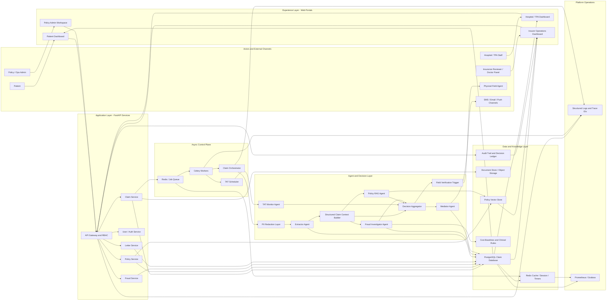
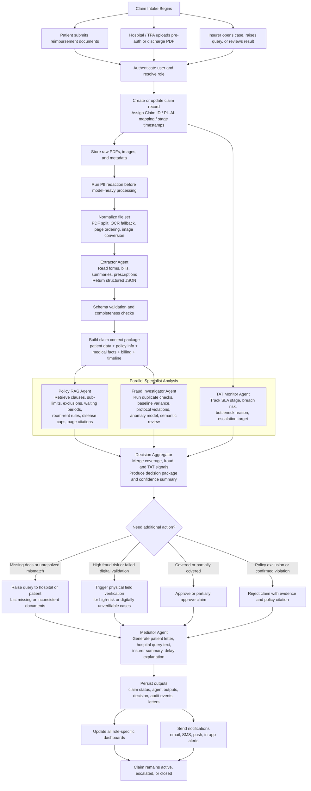
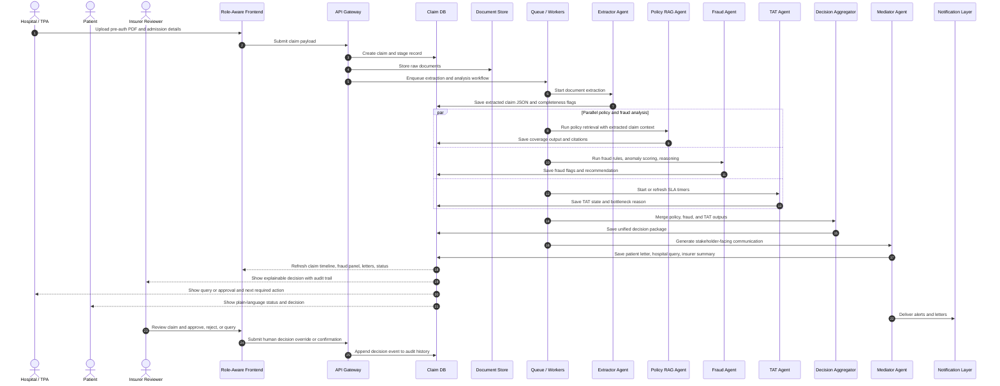
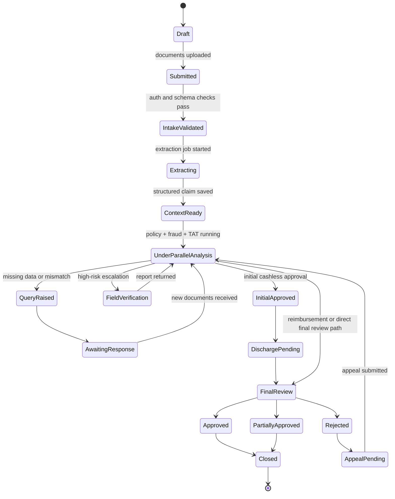

# ClaimHeart Detailed Architecture

This document is the canonical architecture reference for ClaimHeart. It expands the earlier single-diagram draft by combining:

- the product workflow described in `docs/index.html`
- the earlier architectural intent in the previous `docs/architecture.md`
- the intended repository structure documented in `file.txt`

The result is a more complete target architecture for a glass-box, multi-agent medical claim adjudication platform that serves three primary user groups:

- patients
- hospitals / TPAs
- insurance companies

It also explicitly models the agent layer, the shared orchestration path, and the role-specific dashboard experiences that were missing or underexplained in the earlier version.

## 1. Architecture Objectives

ClaimHeart is designed to do five things on every claim:

1. ingest raw medical insurance documents from the right stakeholder
2. convert those documents into structured claim data
3. run policy, fraud, and SLA checks with explainable outputs
4. produce a final decision package with citations, evidence, and next steps
5. surface that package differently for patients, hospitals / TPAs, and insurers

The architecture is intentionally glass-box. Every important output must be traceable to:

- an uploaded document
- a retrieved policy clause
- a deterministic rule
- a statistical signal
- a human action
- or an LLM-generated explanation that references upstream evidence

## 2. Actor and Channel Model

| Actor | Primary Goal | Main Entry Surface | What the System Must Return |
|---|---|---|---|
| Patient | Track cashless or reimbursement claim status and understand decisions | Patient dashboard, SMS, email, notifications | Plain-language status, delay reason, approval or denial explanation, next steps |
| Hospital / TPA | Submit pre-auth and discharge documents fast, respond to insurer queries, avoid TAT breach | Hospital / TPA dashboard | Upload tools, claim queue, open queries, document gaps, live TAT clock |
| Insurance Reviewer / Doctor Panel | Triage claims, verify coverage, inspect fraud signals, issue final decision | Insurer operations dashboard | Structured claim, policy citations, fraud evidence, recommendation, audit trail |
| Policy Admin / Operations | Maintain policy knowledge base and benchmark data | Policy admin workspace | Policy upload status, indexing health, version history |
| Physical Field Agent | Verify suspicious high-risk claims on the ground | Field verification workflow | Assignment, claim packet, verification checklist, report submission |

## 3. System Context

ClaimHeart has two major runtime paths:

- claim processing path: handles live claims from intake through decision
- knowledge ingestion path: keeps policy documents, cost baselines, and operational rules fresh

The frontends are role-aware views on top of one shared backend platform. The same claim record is rendered differently depending on who is logged in:

- patient view emphasizes clarity and reassurance
- hospital / TPA view emphasizes throughput and missing-work resolution
- insurer view emphasizes explainability, fraud triage, and decision control

## 4. Layered System Architecture

## 5. Core Processing Workflow

The main claim workflow starts when a patient or hospital submits a document set. The system then builds a unified claim context, runs specialist agents, merges their outputs, and pushes stakeholder-specific results.

## 6. Detailed Sequence of a Live Claim

This sequence makes the runtime handoff between dashboards, API, workers, agents, and final communications explicit.

## 7. Agent Committee and Responsibilities

The claim workflow is not a monolithic AI call. It is a committee of specialized services coordinated around one shared claim context.

| Component | Role in Pipeline | Typical Inputs | Typical Outputs | Why It Exists |
|---|---|---|---|---|
| Claim Orchestrator | Owns task order, fan-out, retries, and merge timing | Claim ID, workflow stage, task status | Async task graph, retries, status transitions | Keeps the pipeline deterministic and observable |
| PII Redaction Layer | Removes sensitive personal identifiers before heavy model use | Raw PDFs, patient details | Redacted copies, masking map | Supports HIPAA / DPDP style privacy posture |
| Extractor Agent | Converts unstructured files into machine-usable claim JSON | Pre-auth forms, discharge summaries, bills, reports | Structured claim entities, missing field flags | Eliminates manual PDF reading bottleneck |
| Policy RAG Agent | Finds the exact policy rule that applies to the current claim | Diagnosis, procedure, costs, policy metadata | Coverage decision, citations, page and section references | Makes coverage decisions auditable instead of generic |
| Fraud Investigator Agent | Detects obvious and subtle fraud patterns | Structured claim, prior claims, cost baselines, protocols | Fraud score, evidence, recommendation | Protects against hospital and patient-side abuse |
| TAT Monitor Agent | Watches claim stage timers and explains delays | Stage timestamps, open queries, document status | Warning, breach state, bottleneck reason, escalation target | Prevents silent queue delays and SLA misses |
| Decision Aggregator | Merges specialist outputs into one insurer-grade package | Coverage, fraud, TAT outputs | Final claim recommendation, confidence summary | Centralizes decision logic and removes conflicting outputs |
| Mediator Agent | Adapts the same decision into stakeholder-specific language | Final decision package, role, language preference | Patient letter, hospital query, insurer summary | Makes the system usable by humans without losing detail |
| Field Verification Trigger | Escalates suspicious cases into a physical workflow | Fraud severity, unresolved mismatch, failed digital validation | Dispatch request, verification status | Handles cases where documents alone are insufficient |

## 8. Dashboard Architecture for the Three User Types

The platform needs to show the same backend truth differently for each role. This section is important because the earlier architecture draft underrepresented the UI layer.

### 8.1 Patient Dashboard

Primary purpose:

- reduce confusion
- expose claim status in plain language
- make denials understandable
- allow document upload or appeal without calling support

Core modules:

- active claims list
- claim timeline
- uploaded documents and missing document prompts
- patient letter viewer
- approval / denial amount summary
- delay explanation panel
- appeal or follow-up action card

System dependencies:

- claim status from the central database
- mediator output for plain-language messaging
- TAT agent output for delay reasons
- policy citations translated into patient-safe wording

### 8.2 Hospital / TPA Dashboard

Primary purpose:

- accelerate claim submission
- reduce back-and-forth caused by incomplete documentation
- help staff beat insurer TAT thresholds

Core modules:

- claim intake form and PDF upload
- queue of submitted claims
- open query inbox from insurer
- document completeness flags from extractor
- TAT countdown and breach warnings
- discharge-stage pending action list

System dependencies:

- extractor completeness output
- mediator-generated formal query text
- TAT agent warnings
- live claim stage state from shared workflow tables

### 8.3 Insurance Company Dashboard

Primary purpose:

- prioritize risk
- verify explainability
- decide fast without losing control

Core modules:

- decision queue sorted by fraud risk and SLA urgency
- structured claim view
- policy citation panel
- fraud rationale and anomaly flags
- letter preview and communication approval
- audit trail and human override controls
- TAT operations panel
- field verification trigger for suspicious claims

System dependencies:

- aggregator decision package
- raw specialist outputs from policy, fraud, and TAT agents
- policy vector retrieval evidence
- audit ledger

## 9. Role-to-UI Composition Model

The repository layout suggests workspace-oriented routes such as claims, fraud, letters, and policies. Those workspaces can be composed into role-specific dashboards instead of forcing one generic UI on every user.

| Workspace / Module | Patient View | Hospital / TPA View | Insurer View |
|---|---|---|---|
| Claims workspace | Timeline and status only | Submission, tracking, query response | Structured review and decision queue |
| Fraud workspace | Hidden or heavily simplified | Usually hidden | Full fraud triage and evidence panel |
| Letters workspace | Read-only decision letters | Query and response communications | Draft review, edit, approve |
| Policies workspace | Hidden | Hidden | Admin or reviewer-only citation and ingestion tools |
| Audit trail | Simplified event history | Claim event history | Full audit ledger and override log |

This is the cleanest way to reconcile:

- a shared technical platform
- three distinct user experiences
- one source of truth for claims and decisions

## 10. Claim State Model

The claim lifecycle is stateful. A good architecture document must show that a claim can move forward, pause for documents, escalate, and return to review without losing history.

## 11. Data and Storage Architecture

| Data Domain | Storage Pattern | Notes |
|---|---|---|
| Claim master record | PostgreSQL | Claim ID, stage, actor IDs, timestamps, current status |
| Raw uploaded documents | Object storage / S3-compatible store | Original PDFs, images, report bundles |
| Redacted working copies | Object storage | Safe copies for AI pipelines when needed |
| Extracted structured claim JSON | PostgreSQL JSON columns or normalized tables | Shared input for downstream agents |
| Policy text embeddings | Vector store | Semantic retrieval for policy matching |
| Fraud findings | PostgreSQL | Deterministic flags, anomaly scores, evidence, recommendations |
| Letters and communications | PostgreSQL + object store if needed | Patient letters, hospital queries, insurer summaries |
| TAT timers and stage clocks | PostgreSQL + Redis cache | Fast warning evaluation and dashboard updates |
| Audit ledger | Append-only operational table | Human and machine actions with timestamp and actor |

## 12. External Knowledge and Reference Inputs

The live claim is not the only data source. Several external or pre-ingested knowledge systems are needed for reliable decisions.

| Source | Used By | Purpose |
|---|---|---|
| Policy PDFs | Policy RAG Agent | Coverage, exclusions, sub-limits, waiting periods |
| Claim history | Fraud Agent, Aggregator | Duplicate detection, longitudinal checks |
| Regional cost baselines | Fraud Agent | Detect extreme cost inflation |
| Clinical protocol rules | Fraud Agent | Detect impossible or excessive test patterns |
| SLA thresholds | TAT Agent | Determine warnings and breaches |
| Notification channels | Mediator Agent | Deliver patient and operator communications |

## 13. Policy Knowledge Ingestion Workflow

Claim processing only works if the policy knowledge base is already prepared. This is a separate but essential architecture path.

```mermaid
flowchart LR
    admin["Policy Admin / Insurer Ops"] --> upload["Upload policy PDF and metadata"]
    upload --> store["Store source document"]
    store --> chunk["Chunk and structure policy text"]
    chunk --> embed["Generate embeddings"]
    embed --> vector["Write to vector store"]
    vector --> version["Register policy version and status"]
    version --> ready["Policy available for claim-time retrieval"]
```

Key requirements:

- version policies by insurer, plan, and effective date
- retain original PDF for citation and audit
- index tables and sub-limit sections well, not just plain paragraphs
- invalidate or re-index old embeddings when policy wording changes

## 14. Explainability and Audit Design

ClaimHeart should never return a naked answer. Every high-value output must carry its evidence.

Minimum explainability package for insurer review:

- extracted structured claim summary
- cited policy clause with page number
- fraud flags with explicit evidence
- confidence or severity score
- TAT stage and any active bottleneck reason
- generated communication draft
- full action log of who or what changed the claim last

Minimum explainability package for patient view:

- current claim status
- plain-language reason for delay, approval, partial approval, or rejection
- what amount is approved and what amount is not
- what document or action is required next

## 15. Operations and Reliability

The architecture is not complete without runtime controls.

Operational concerns:

- queue-backed execution so document extraction and reasoning do not block the API
- idempotent claim jobs so repeated uploads do not corrupt state
- retry-safe task design for LLM and document-service failures
- trace IDs across API calls, workers, and agent outputs
- dashboards for queue depth, extraction latency, fraud review load, and TAT breach counts
- manual override capability for insurer reviewers with audited justification

Suggested operational split:

- synchronous path: auth, upload receipt, claim creation, immediate validation
- asynchronous path: extraction, policy retrieval, fraud analysis, mediator generation
- scheduled path: TAT monitoring, reminder jobs, breach escalation

## 16. Repository Mapping

The current repository layout already hints at the intended architecture even where code is still sparse.

| Repository Area | Architectural Responsibility |
|---|---|
| `backend/app/api/routes/` | External HTTP boundary for claims, fraud, letters, policies, users, health |
| `backend/app/services/` | Service layer coordinating repositories and task dispatch |
| `backend/app/tasks/` | Asynchronous worker entry points for extraction, analysis, communication |
| `backend/app/agents/extractor/` | Document extraction and vision-processing logic |
| `backend/app/agents/policy/` | Policy retrieval, vector lookup, citation logic |
| `backend/app/agents/investigator/` | Fraud rules, anomaly detection, semantic investigation |
| `backend/app/agents/mediator/` | Letter generation and stakeholder-specific messaging |
| `backend/app/pipelines/` | Shared RAG orchestration and document chunking |
| `backend/app/utils/` | Redaction, PDF handling, cost baselines, S3 helpers, OCR fallbacks |
| `backend/app/db/` | Models, repositories, session management, migrations |
| `frontend/app/claims/` | Claim intake and review surfaces |
| `frontend/app/fraud/` | Fraud operations workspace |
| `frontend/app/letters/` | Communication workspace |
| `frontend/app/policies/` | Policy administration workspace |
| `frontend/components/claims/` | Uploads, PDF viewer, timeline, entity presentation |
| `frontend/components/fraud/` | Fraud score and evidence presentation |
| `frontend/components/letters/` | Letter editing and audit inspection |
| `docker/grafana` and `docker/prometheus` | Operational monitoring stack |

## 17. Final Architectural Summary

ClaimHeart should be understood as one shared adjudication platform with four visible surfaces:

- a patient-facing clarity surface
- a hospital / TPA throughput surface
- an insurer decisioning surface
- an operational agent pipeline underneath all three

The correct mental model is not "one dashboard plus some AI."

The correct mental model is:

1. multi-role intake
2. shared claim record
3. privacy-safe document processing
4. parallel specialist agents
5. explicit decision aggregation
6. stakeholder-specific communication
7. fully auditable lifecycle state

That is the architecture this project should communicate and eventually implement.
